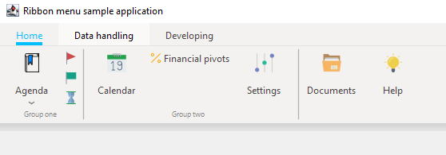

# JRibbonMenu
### Ribbon Menu Bar implementation in Java.




## Installation
The project can be build using Ant. The result will be appear in deploy directory as the name of **RibbonMenu.jar**.
```sh
#usage
ant all
```

## Usage

Here is an example how to use library.
You can find entire code in **src/hu/csekme/RibbonMenu/Sample.java** file.
```java

// Add our first tab
        Tab tab1 = ribbonBar.addTab("Home");
        tab1.setGroupName("Group one");

        // Add button to first tab
        Button agenda = tab1.addButton("Agenda");
        agenda.setImage(Util.accessImageFile("agenda.png"));

        // create menuitem for button
        RibbonMenuItem r1 = new RibbonMenuItem("Create new date", Util.accessImageFile("newDate.png"));
        agenda.addSubMenu(r1);
        // create some more quickly
        agenda.addSubMenu(new RibbonMenuItem("Clear all"));
        agenda.addSubMenu(new RibbonMenuItem("Reminders"));
        // create selectable
        agenda.addSubMenu(new RibbonMenuItem("Forward to mail", true));

        // add some mini buttons without caption
        Button flag_1 = tab1.addSlimButton("");
        flag_1.setImage(Util.accessImageFile("flag.png"));
        Button flag_2 = tab1.addSlimButton("");
        flag_2.setImage(Util.accessImageFile("flag-1.png"));
        Button flag_3 = tab1.addSlimButton("");
        flag_3.setImage(Util.accessImageFile("hourglass.png"));

        // Add seperator (this means the end of the previous group)
        tab1.addSeperator();
        // Set new group name
        tab1.setGroupName("Group two");

        Button calendar = tab1.addButton("Calendar");
        calendar.setImage(Util.accessImageFile("calendar.png"));

        Button finance = tab1.addSlimButton("Financial pivots");
        finance.setImage(Util.accessImageFile("percent.png"));

        Button settings = tab1.addButton("Settings");
        settings.setImage(Util.accessImageFile("controls.png"));
        tab1.addSeperator();

        Button documents = tab1.addButton("Documents");
        documents.setImage(Util.accessImageFile("folder-9.png"));

        Button help = tab1.addButton("Help");
        help.setImage(Util.accessImageFile("idea.png"));

        Tab dataHandling = ribbonBar.addTab("Data handling");

        Button shares = dataHandling.addButton("Shares");
        shares.setImage(Util.accessImageFile("share-1.png"));
        dataHandling.addSeperator();

        Button filter = dataHandling.addButton("Apply filter");
        filter.setImage(Util.accessImageFile("filter.png"));
        filter.addSubMenu( (event)->{ JOptionPane.showMessageDialog(null, "You pressed");  }, "filter one" );
        filter.addSubMenu( (event)->{ JOptionPane.showMessageDialog(null, "You pressed");  }, "filter two" );

        Tab developing = ribbonBar.addTab("Developing");
        Button server = developing.addButton("Servers");
        server.setImage(Util.accessImageFile("server-1.png"));
        tab1.setSelected(true);


```
 
## The result is something like this below (depends on OS)

 

 <hr/>


## Please donate free coffee here
[](https://www.paypal.me/csekme)